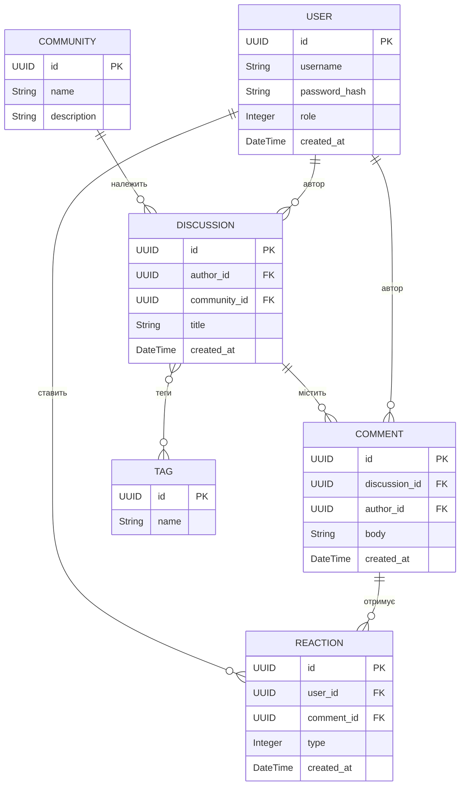

# Форум з програмування та операційних систем

ER-модель даних форуму: користувачі створюють обговорення в спільнотах, пишуть коментарі, позначають обговорення тегами й ставлять реакції на коментарі. Специфікація — `spec.md`, ER-діаграма Mermaid — `model.mmd`.

